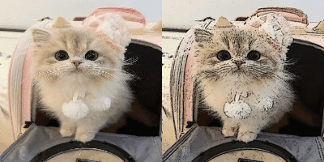

# ImageToCartoon

This repository contains a Python script to convert images into a cartoonish style using OpenCV.  
This is just a silly project from a lazy Saturday, I may improve on it one day who knows...


<table>
  <tr>
    <td></td>
  </tr>
</table>


---

## Requirements

Install requirements before using (virtual env recommended):
```bash
pip install -r requirements.txt
```

---

This version of the README provides a straightforward presentation of input and output image pairs in a grid format without additional titles. Adjustments can be made further based on your specific preferences or requirements.

## Usage

To cartoonize images, run the script with the path to the input directory:

```bash
python main.py --src_dir inputs/ --dst_dir outputs/
```

This will generate cartoonized images in the `outputs/` directory.


## Acknowledgements

There are __much__ fancier implementations of this idea.  
Check out [this repo](https://github.com/chasehamrick/Turn-Picture-into-Art) (great results, meh writeup 🤷‍♀️)